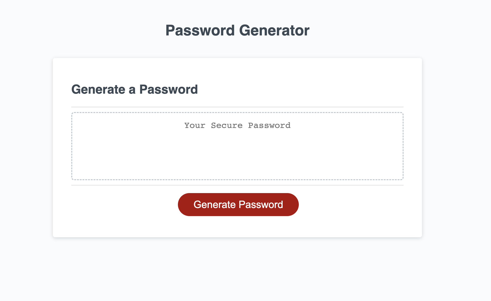

# Password-Generator

## Description
In this challenge, I create an application to generate a random password based on criteria: At least 10 characters but no more than 64, numbers, lowercase letters, uppercase letters and special characters.
The code validate for each input and at least one character type should be selected.
Once prompts are answered then the password should be generated and written to the page.

<!-- PROJECT -->
 

  <a href="https://pixelfobia.github.io/Password-Generator/">
		
Visit the Github Page ->

  </a>

## Table of Contents

-Just check the console

## Screenshots

## Credits

N/A

## License

The last section of a high-quality README file is the license. This lets other developers know what they can and cannot do with your project. If you need help choosing a license, refer to [https://choosealicense.com/](https://choosealicense.com/).

---

